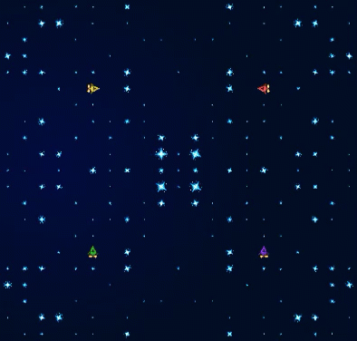
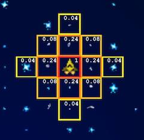

# Introduction - Team 677
This writeup details the implementation of the 29th place (out of 1139 teams) Halite IV agent and the learnings of the team that wrote it. For those who do not know, [Halite IV](https://www.kaggle.com/c/halite/overview) is a resource management game created by Two Sigma where you control a fleet of ships attempting to collect as much halite as possible. An example game can be seen here:

Before reading further, be sure to take a moment to skim the [game rules](https://www.kaggle.com/c/halite/overview/halite-rules) to have a better understanding of how everything works. This post is divided into two sections. The first section discusses our macro-level takeaways from the competition and the development skills we learned, while the second section dives into the agent implementation specifics. Big thanks to Kaggle and Two Sigma for creating an incredibly fun and well-run simulation competition, as well as to our fellow competitors for their fascinating insights and awesome writeups!

# Part I - How to Approach Halite-style Problems

While we learned a lot from thinking through and solving the many individual smaller-scale problems that formed the basis of our Halite bot, perhaps the most important things we discovered were lessons on forming high-level problem-solving approaches for large, complex problems like Halite. Before Halite IV, no one on the team had had any experience with coding competitions, and there are a handful of key takeaways which we plan to use when tackling future computer science projects. Hopefully they will provide some guidance to other first-time coding competitors, helping them avoid the biggest issues we ran into.

## 1. Take time to plan a modular, extensible solution framework.
When our team first read the game rules of Halite, we had a single immediate thought: "*this game is all about mining!*" One team member brought up the potential idea of attacking, but after a short discussion we wrote it off as useless. After all, attacking is risky and would therefore surely be a net negative for our bot&mdash;any opponent with a half-decent collision avoidance mechanism would be uncatchable, right? With that settled, we got to work theorizing and optimizing the perfect mining bot. For the first six weeks of the competition, not a single line of code was written. We ensured that every aspect of our design was sound, solved the edge cases that needed solving, and wrote pseudocode before even thinking of opening our IDEs to avoid falling into traps created by short-sighted decision making. And yet, after all that careful planing, by the final weeks of the competition our code base was a tangled mess full of baffling logic that supposedly used to make sense, leaving us wondering where everything went wrong.

As can be seen from the above anecdote, our initial bot was born to mine. Everything about the project architecture and code was designed to allow for a modular, extensible mining bot. However, we later realized that contrary to our initial assessment, our bot should be able to attack enemy ships. And prioritize attack targets. And defend shipyards. And help friendly ships. And chase away enemy mining ships. And camp enemy shipyards. And do a hundred other things that we never originally considered. How do you incorporate a hundred new strategies into a bot that is designed to mine?

The short answer is, you don't. Shoehorning an attack strategy into our modular, extensible mining strategy required us to throw our thoughtful design work out the window, and adding more strategies became exponentially more difficult. The final result was a series of hacky workarounds and hard-coded special casework that made it nearly impossible to trace through and understand why our agent was doing what it was doing. The lesson here is to challenge your problem assumptions from the very beginning, and to take extra time to understand the problem from various angles beyond the first way that seems to make sense. Moreover, abstracting the entire solution framework to be able to handle unforseen changes is incredibly useful. Through this abstracted lens, mining becomes a single potential "mission" that a ship can take on among many other missions that may exist. Even though mining was the only mission we could think of initially, building the agent with the consideration that other missions may come up in the future would have been very helpful (team "KhaVo Dan Gilles Robga Tung" has a great description of this kind of solution framework in [their writeup](https://www.kaggle.com/c/halite/discussion/183312)). This framework would have allowed the missions themselves to be modular and extensible, making it easy to add new missions like attacking or defending later on.

## 2. Let data drive decisions, and design with data collection in mind from the start.
There is a saying which goes, ["collecting data is cheap, but not having it when you need it can be expensive."](https://www.datadoghq.com/blog/monitoring-101-collecting-data/) Halite IV made the truth of this quote very clear to us. We never had a good way of collecting data about our bot's decision-making process, and therefore did not have a holistic way of analyzing games and determining what needed to be improved. This lack of a data collection and analysis pipeline meant that we had to watch, evaluate, and interpret our own game replays by hand (by this point, we expect that all the data scientists reading this writeup have fainted&mdash;apologies in advance). This manual process was tedious and made it tough to spot weird inconsistencies and bugs in the first place, but, even worse, it meant that we were basing our changes on evidence with a sample size of 1. Such micro-level decision making inevitably causes misinterpretations and leads to "fixing bugs" without recognizing larger overarching issues. It also made it basically impossible to accurately evaluate the effects of new features or to productively tune hyperparameters. We found that by the end of the competition, many tuned versions of almost identical bots ended up with similar elo ratings, suggesting that the time spent tuning was not useful and could have been spent improving other aspects of the bot. A proper logging and analysis system would have prevented these headaches, and we believe that our inability to let data drive decisions near the finale was the barrier that kept us from achieving a higher placement.

That said, it is important to acknowledge that we actively decided not to build any data tooling up front. Given this competition was our first, we were not sure that the high fixed cost of building these tools would pay off, since we were not sure how well we would perform. Interestingly, we managed to get pretty far without any data analysis at all; we built our first few bots without looking at any leaderboard games, and they peaked around the top 50. Once our bots were competing at a higher level, however, the necessity of data tooling became clear, and we struggled and eventually failed to break the top 25.

# Part II - The Bot

## Targeting & Amortized Values
Similar to other teams, our top-level logic pipeline chose a target square for each ship and then assigned each ship an optimal action to take to reach that target. To choose each target and action, our architecture computed an amortized value for every target which generally took the form

## Dominance Map
In order to determine the probability of successfully reaching a given square, we needed a representation of which players dominated which parts of the board. Our final dominance map consisted of two components: a "global" dominance map and a "ship-specific" dominance map. For the global dominance map, we created a sphere of influence for every enemy ship. The level of influence a ship exerts on a square is proportional to the probability that the ship will enter that square at some point over the next 2 turns, given that the ship is moving completely randomly. These probabilities effectively formed a plus-shaped Gaussian blur around each enemy ship, as can be seen from the diagram below.

Once we had a sphere of influence for each enemy ship, we used them to calculate for each square the probability that no enemy ship would enter that square for the next 2 turns. These probabilities formed the base of our global dominance map, with higher values indicating smaller likelihoods of any enemy ship crossing a square. Therefore, a higher value implied that a square was safer.

For the ship-specific dominance map, we used the same process as above but only factored in enemy ships lighter than the current ship, rather than all enemy ships. The final dominance map for each ship was a linear combination of the global dominance map and that ship's specific dominance map. The ship-specific dominance map was weighted to be about three times as important as the global dominance map, with the idea that the global map provided a long-term deterrent keeping friendly ships away from enemy-dominated territory while the ship-specific map helped influence short-term collision avoidance.

## Assigning Ship Mode
The final bot allowed ships to switch between two "modes": mining and attacking. All ships began as mining ships when spawned, and at the end of every turn each ship reevaluated whether it could attain a higher value target as a mining ship or as an attacking ship. The ship would switch to the mode promising the higher value on the next turn. Because the exact mining or attacking value of a ship depended on the actions of other friendly ships, when reevaluating the modes each ship assumed it would be the last to act and therefore the last to choose its target on the next turn. This method effectively led to a conservative lower-bound estimation of the value of each mode.

However, we found that the mining and attacking values were often relatively close, leading to ships that would flip-flop between modes on consecutive turns. This constant switching caused ships to continually change targets, thereby making them less effective. To combat this issue, we made the modes "sticky"&mdash;for a ship currently in mining mode to switch to attacking mode, the attacking value would have to be significantly higher than the mining value (and vice versa). This stickiness allowed ships to maintain more consistent long-term behavior.

## Mining
For each mining ship, we compiled a list of all squares which contained halite and computed an amortized value for each of those squares. Specifically, the amortized value of a square was the solution to the maximization problem

,

where `H` was the amount of halite in the square, `t` was the amount of time to spend mining the square, `dist` was the ship's Manhattan distance to the square, and `D` was the downweighting factor for the square given by the dominance map. Note that we did not factor in returning to base when computing these mining values at all. This choice was an active one, as we believed that having a separate model for deciding when a ship should return would serve us better.

As an interesting side note, our initial attempts at solving this maximization problem were far too slow. Even with incredible numerical libraries like `numpy` and `scikit`, maximizing a function in Python is time consuming. Our first optimization was to simply calculate the value of the expression for all integers in the range 1 to 20 and to take the integer that produced the highest value. Here, we both knew that ships could not mine for a fractional number of turns and assumed that no ship could ever feasibly mine a single spot for longer than 20 turns. However, this piece was still the slowest part of our entire bot. Finally, after toying with the expression for a while, we realized that the `H` term disappears in the derivative of the function. This fact implied that the solution was not based on `H`! Moreover, since `dist` was fixed for a given (ship, square) pair, the expression's solution only depended on `t`. Therefore, we were able to ignore `H` and `dist`, pre-compute all values of the expression for `t=[1, 20]`, and do a constant-time lookup at runtime.

Once every ship had its list of mining targets and associated amortized values, we used "loss" to assign a specific target to each ship. This term means that we determined the mining ship assignment order by how much lower a ship's amortized value would be if it was not assigned to its best mining target. In other words, we wanted to minimize the lost opportunity cost each ship would experience if it was not assigned to its optimal mining target. This idea translates mathematically to

.

Each time a target was assigned to a mining ship, we removed that target from consideration and updated the amortized value lists, and thereby the loss, of each ship. This idea attempted to maximize the total mining value over all ships while still using a greedy algorithm.

However, it is clear that a greedy algorithm is suboptimal here. To get closer to the best possible solution, we allowed ships to look one step beyond their current best mining target. Once a ship was assigned a target <code>t1</code>, we recomputed the mining target amortized value list for that ship, this time assuming that the ship was already on top of <code>t1</code> (and therefore excluding it from consideration). The best target in this new list, say <code>t2</code>, was a proxy for where the ship would want to go after reaching <code>t1</code>. We then discounted the value of <code>t2</code> in the amortized value lists of all other ships by a constant factor  to discourage other ships from traveling to <code>t2</code> right now. This one-step-ahead discounting of future mining spots was an attempt to better coordinate the swarm of mining ships, spreading them out and preventing all our ships from targeting a small number of very valuable areas.

## Attacking
Similar to mining ships, for each attacking ship we compiled a list of amortized values for each square that was a viable attack target. A square was a viable attack target if it was within a Manhattan distance of 2 from any enemy ship with nonzero cargo. The amortized attack value for each square was

,

where <code>Edist(2)</code> was the set of enemy ships with nonzero cargo within Manhattan distance 2 of the square, and <code>ne</code> was the number of friendly ships already assigned to attack enemy ship `e`. The attacking amortized value of any particular enemy ship is its expected capture value divided by the time it will take to successfully capture it. The division by <code>ne + 1</code> distributes this value evenly among all friendly ships which contributed to the capture (including the current ship, assuming it will be assigned to attack `e`).

The expected value of capturing an enemy ship `e` was defined as

.

Here, <code>(probability of intersection)e</code> was the estimated probability that `e` would move to the current square at some point over the next 2 turns. `b` was a constant defining the implicit value of destroying an enemy ship, and <code>min(500, cargoe)</code> factored in `e`'s cargo with a cap of 500. This cap was implemented to prevent overvaluing very high cargo ships, as these ships would typically convert to a shipyard if they sensed they were in immediate danger, stopping us from actually capturing them.

The expected number of steps needed for a friendly ship to capture an enemy ship `e` was defined as

,

where `dist` was the Manhattan distance from our ship to the square and <code>ctimee(ne + 1)</code> was a function representing the amount of time it would take to successfully capture `e` given <code>ne + 1</code> friendly ships were chasing `e`. This function monotonically decreased as <code>ne</code> increased, as we believed that more chasing ships would lead to an exponentially shorter capture time.

After computing these amortized attack value lists, we again assigned an attack target to each ship in order of ship loss (in the same fashion as mining).

## Assigning Actions to Ships
So far we have only discussed how we assigned targets to ships. However, once the targets had been assigned, we still needed to pick an optimal movement action for each ship to reach its target from its current position. To determine the order of movement action assignment, we again used loss, but made the exceptions that ships in immediate danger and ships returning to base had priority.

We labeled each movement action with a positive value if it moved in the direction of the target and a negative value if it moved away from the target. Within each of these two cases, we gave a larger value to the direction which provided the most flexibility for future movements along the shortest path to the target. For example, if the shortest path to our target was 4 squares up and 7 squares left, we would prefer to move left rather than up because in the future we would have more chances to move in either direction (4 squares up and 6 squares left remaining instead of 3 squares up and 7 squares left). The value of staying still was just the halite gained from mining the current square. We also added a collision weighting to the movement values (described in the Collision Avoidance section) to encourage safer movements.

There were a few edge cases in which our ships wanted to move through each other (adjacent ships with opposite desired movements) or would block each other. In these cases, if the ships were in the same mode and neither were returning to base, we simply swapped their targets.

## Collision Avoidance
To implement collision avoidance, we needed a way to anticipate what opponent ships would do. We stored the previous 3 actions each enemy ship had taken, and used those actions to compute a movement vector for each enemy ship. This movement vector gave us some idea of where the enemy ship would likely move in the future, and was general enough to not overfit to any particular enemy strategies (at some point we considered implementing a more complex collision avoidance algorithm which would try to account for specific enemy strategies, but we never got around to fleshing out the idea). The movement vector was combined with a Gaussian blur to factor in prediction confidence and give a positive weight to unpredictable directions.

Based on our enemy movement predictions, for each enemy player we added a collision factor to each square of the form

where `probability of move` was the probability an enemy ship would move to the square based on its movement vector, `collision coef` was the number of lighter enemy ships from that enemy player surrounding our ship, and `collision cost` was

,

which was the amount of halite that would be lost on the ship's destruction (500 for the price of the ship plus its current cargo) summed with the loss in amortized value between the current ship and a new ship which would replace it. The inspiration behind `collision coef` was that enemy players with more surrounding ships were more of a threat, as they could coordinate their ships to attack more effectively.

## Returning To Base
As mentioned before, the ship return logic was an independent subsystem of the agent. Attacking ships simply returned if they had gained any cargo. However, note that an attacking ship with cargo was allowed to transition into mining mode if mining was worth more than returning. Mining ships returned only if at least one of the following four criteria were met: (1) the ship was in "danger", (2) the ship was too "heavy", (3) the game was about to end, or (4) depositing the ship's cargo right now would let us spawn a new ship sooner.

We defined "danger" for each ship based on the number of lighter enemy ships within a certain distance over several turns. On any given turn, lighter enemy ships that were 1 or 2 Manhattan distance away from a ship added 1 or 2 points to that ship's "danger" counter. If the sum of the "danger" counter over the past 3 turns exceeded 5 for a ship, that ship was determined to be in danger and would satisfy condition (1) above.

The definition of "heavy" changed over the course of the game and was based on a global danger value which started near zero and was incremented every time a ship was in danger (meeting condition (1) above). As the global danger value increased, we wanted to incentivize our ships to return more often, the idea being that a high global danger value implied that enemies would be more likely to try to capture our ships. In practice, we gave the square containing the nearest dropoff to the ship a value of . Therefore, if this value was greater than the value of mining, the ship would decide to return.

For the third condition, each ship was forced to return once the game step reached , where `dist` was the Manhattan distance to the nearest dropoff and `buffer` was a constant to allow additional time for ships to return to base in case the shortest path was blocked. Any ship that had cargo after this point was forced to return (and no longer cared about colliding with friendly ships).

Finally, near the beginning of the game we wanted ships to return more frequently in order to fund the creation of new ships. We defined the returning value of a ship to be . We tried predicting `new ship value` by combining computed amortized mining and attacking values with a dampening factor, but this approach was not robust to different enemy strategies&mdash;given more time, we would try to improve this area.

## Shipyard Spawning
Spawning shipyards was one of the most difficult problems for us. Unlike our amortized value approach for mining and attacking, we never found a good way to quantitatively value what properties made one shipyard position better than others (other than proximity to good halite spots). It is easy to see at a high level how a well-positioned shipyard acted as both a hub for ships and a crucial factor in board control, but translating those insights into an implementation proved tough. Our shipyard spawning algorithm focused on providing a mining hub and did not factor in which spots would be beneficial for attacking. This lack of consideration for attacking frequently resulted in situations where attacking ships would not be able to safely and successfully return to the shipyard after killing enemy ships.

Our shipyard spawning algorithm began by creating a list of candidate shipyard squares. A square needed to meet four criteria to be a valid shipyard square: (1) be within a certain distance from at least 2 of our ships, (2) be within a certain distance from at least 1 of our shipyards, (3) be at least a certain distance away from any current shipyard (friendly or enemy), and (4) not be adjacent to an enemy ship with no halite. These conditions were crafted in line with our belief that shipyards should be used as anchor points for increasing map dominance in a stable way. After computing all candidate squares, we summed the top `N` mining values of nearby squares for each candidate square. This number reflected the total mining value benefit of spawning `N` new mining ships from this square right now. The square with the largest sum would be the new shipyard spot.

Once we had an intended shipyard spot, we needed to decide whether or not we should actually build that shipyard in the future. To do so, we calculated the total savings that the construction of the new shipyard introduced to every ship. Theoretically, each ship would save its current amortized value multiplied by the number of turns saved when returning to the new shipyard versus the old closest shipyard:

.

If the savings from the new shipyard exceeded 500, we saved that location as a future shipyard and allowed ships to consider it a valid return point. The first ship in the future to return to that spot would create the shipyard.
    
## Ship Spawning
Originally, we tried to model the expected returns of a new mining ship over time to determine whether or not to spawn it. In other words, we wanted to answer the question "if we create a ship on turn `t`, how much halite would we expect it to mine and successfully return with?" Unfortunately, this value proved extremely difficult to model, especially after we added the concept of attacking ships and tried to factor in different opponent strategies. Since we felt that we were unable to design an effective model for this subproblem, we ultimately chose to always spawn ships up to a certain turn if we had enough halite to do so. The exact turn chosen was a hyperparameter that we tuned with much experimentation, and ended up being around turn 270 in our final bot.

## Shipyard Protection
While reviewing some of our games late in the competition, we realized that losing shipyards in the early game was almost always a fatal blow to our agent. To protect against this weakness, our first idea was to assign a ship to stay still on the shipyard and protect it. After some thought, we agreed that having a ship stay still on the shipyard would incur too high of a cost. Though replacing a shipyard cost 1000 halite (to convert a ship and spawn a new one to replace it) and protecting only cost 500 (to spawn a defending ship), there was the opportunity cost of not having a ship mine or attack. Moreover, if an enemy managed to destroy our protecting ships, we would have to continually spawn more protecting ships. We therefore concluded that defending a shipyard was only worth it if an enemy attacked us without protection, but stayed away with protection.

Empirically however, we found that a shipyard ended up being worth far more than 1000 halite&mdash;it provided an unquantifiable amount of board control for our ships. This newfound value inspired us to have a protecting ship for every shipyard after reaching a certain total number of ships. We figured that the decreasing marginal value of each new ship would at some point be lower than the value of spending a ship to defend our base. Through trial and error, we tuned this number of ships to be 15.

We added a small optimization which allowed us to always protect a shipyard if it was in immediate danger of being destroyed, even if we were below the protecting threshold: if an enemy ship was nearby and a friendly ship was adjacent to or on top of the shipyard, that ship would move to protect the shipyard.

# Conclusion
Halite IV was an amazingly enjoyable experience for everyone on the team, and we look forward to participating in subsequent competitions! Hopefully our learnings from this time around will let us reach even greater heights next time.